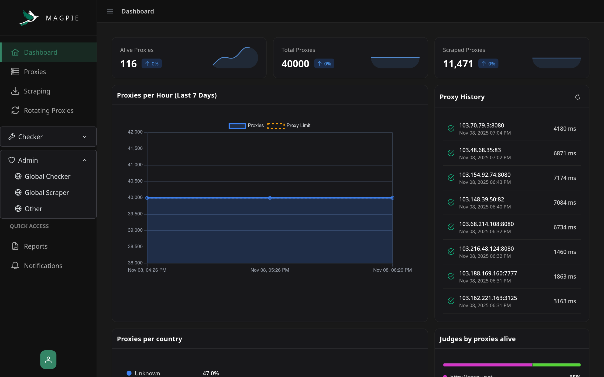
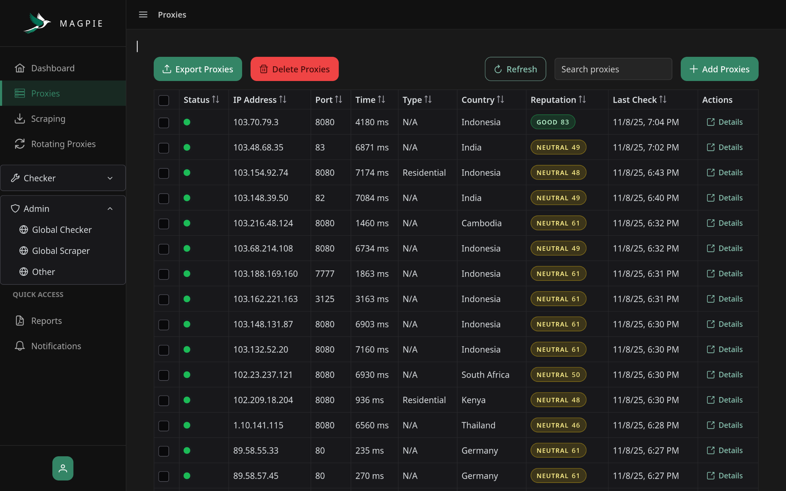
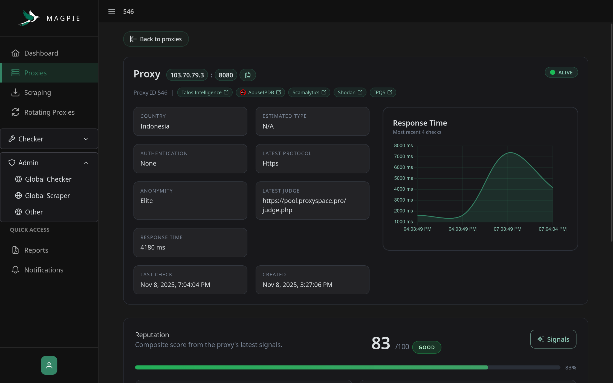
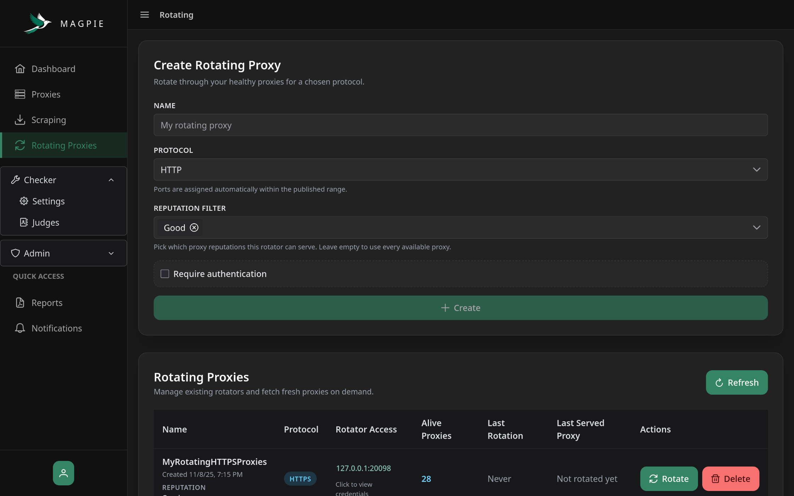
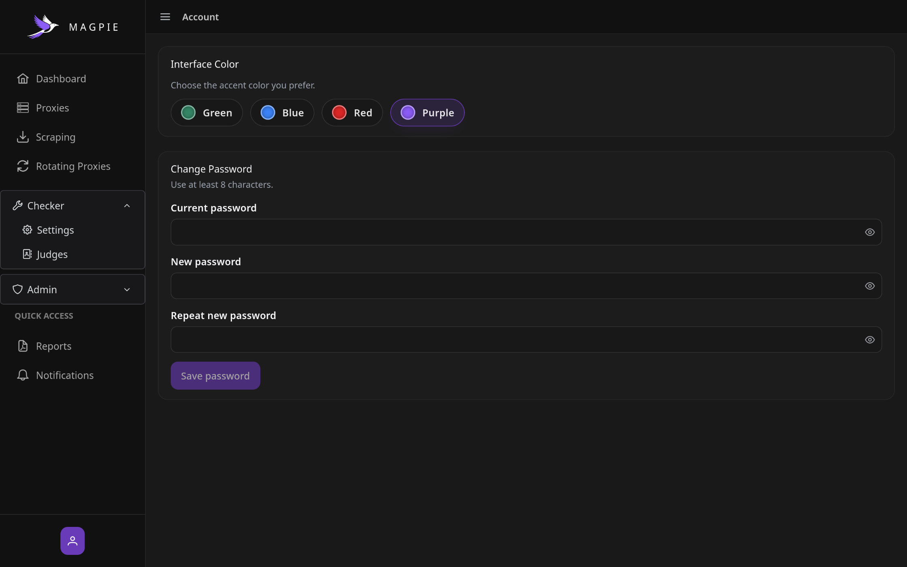

<div align="center">
  
  <h1>MAGPIE</h1>
  <p><strong>Multi-user AIO Proxy Manager</strong></p>
</div>

<div align="center">
  
  
  <a href="https://discord.gg/7FWAGXzhkC">
      
  </a>

[//]: # (  )
</div>

---

> [!NOTE]
> Magpie is in active development. Expect frequent UI polish and API nudges while we harden the core workers.

Magpie runs the boring parts of shared proxy operations: it discovers fresh HTTP/SOCKS endpoints, checks them with configurable judges, enriches them with Geo data, and hands them back through a dashboard, REST, GraphQL, or on-demand rotating listeners.

<details>
    <summary>Screenshots</summary>
    
    
    
    
    
</details>

## Features
- **Automated scraping** — Continuously gathers HTTP/SOCKS proxies from public APIs, text dumps, and feeds.
- **Configurable health checks** — Verifies and checks proxy uptime and latency on an adjustable schedule.
- **Multi-user isolation** — Supports separate accounts and permission scopes for shared hosting.
- **Rotating proxy endpoints** — Instantly spawn self-hosted rotating gateways without manual list management.
- **Enrichment pipeline** — Augments proxies with **geolocation, ISP, and reputation** metadata for advanced filtering.

## Quick Start

1. **Install Prerequisites:**
    - [Docker Desktop](https://www.docker.com/)
    - [Git](https://git-scm.com/downloads)

2. **Clone the project**
   ```bash
   git clone https://github.com/Kuucheen/magpie.git
   cd magpie
   ```
3. **Change secrets** – This step is optional but highly recommended. Change the proxy encryption key in the docker-compose.yml to something you won't forget:
   ```env
   PROXY_ENCRYPTION_KEY=ThisIsMyEncryptionKey!
   ```

> [!WARNING]
> `PROXY_ENCRYPTION_KEY` locks all stored secrets (proxy auth, passwords, and ip addresses).  
> If you start the backend (or update to a new version) with a *different* key than the one used before, decryption fails and previously added proxies will not display or validate.  
> **Fix:** start the backend again using the **previous key** and everything works like before.  
> **Only rotate on purpose:** if you need a new key, export your proxies first.

4. **Bring everything up**
   ```bash
   docker compose up -d --build
   ```
5. **Dive in**
    - UI: http://localhost:5050
    - API: http://localhost:5656/api  
      Register the first account to become the admin.

For geo lookups, create a [MaxMind GeoLite2 account](https://dev.maxmind.com/geoip/geolite2-free-geolocation-data) and generate a License Key. Enter it in the dashboard (Admin → Other) to enable automatic database downloads and updates.

### Updating
Use the helper scripts to pull the latest code and rebuild just the frontend/backend containers.

- **macOS/Linux**:
  ```bash
  ./scripts/update-frontend-backend.sh
  ```
- **Windows (Command Prompt)**:
  ```bash
  scripts\update-frontend-backend.bat
  ```
  Double-click the file or run it from the repo root.

## Local Development
- Services: `docker compose up -d postgres redis`
- Backend: `cd backend && go run ./cmd/magpie`
- Frontend: `cd frontend && npm install && npm run start`

Magpie targets Go 1.24.x, Angular 20, PostgreSQL, and Redis. Keep those versions handy for parity.

## Attributions & External Sources
- [AbuseIPDB](https://www.abuseipdb.com/) — logo used with permission when linking to their site.

## Community
- Discord: https://discord.gg/7FWAGXzhkC
- Issues & feature requests: open them on GitHub.

## License
Magpie ships under the **GNU Affero General Public License v3.0**. See `LICENSE` for the full text. Contributions are more than welcome.
